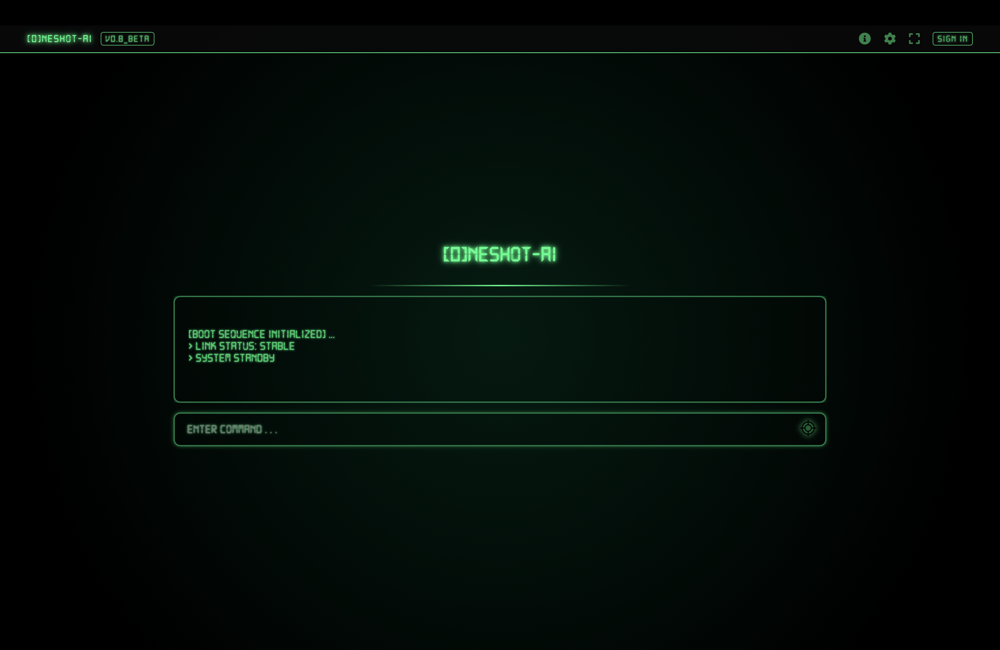

# 0neShot-AI  
*Minimal, single-shot AI terminal for fast, compressed responses.*

<div align="center">
  
</div>

## Overview
0neShot-AI is a **stateless AI console** where every prompt is treated as a fresh command.  
No memory. No chat history. No continuity.  
Just **input → answer**.

This project explores the opposite design philosophy of complex, scaffolded AI systems.  
Where multi-layer interfaces rely on memory, modes, and workflows,  
**0neShot-AI strips everything away to reveal raw model behavior.**

Useful for:
- quick inference  
- terminal-style Q&A  
- environments where stateful chat is undesirable  
- studying baseline LLM output without scaffolding  

---

## Why OneShot Exists
OneShot-AI was built as a minimal, stateless contrast to larger AI systems.  
Its purpose is to expose raw model behavior with **zero memory**, **zero scaffolding**, and **zero continuation logic**.  
This makes it useful as a diagnostic tool, a quick‑query interface, and a philosophical counterweight to my more complex project, DartBoard.

## Features

### Core Interaction
- **Single-shot stateless execution**  
- **Streaming text animation**  
- **Blinking cursor effect**  
- **Internal scrollable terminal console**

### Rendering & Styling
- **Neon terminal aesthetic**  
- **Markdown support** (tables, lists, code, headers)  
- **Syntax highlighting** for code blocks  

### Backend
- **Flask API server**  
- **OpenAI integration** via environment variables  
- **Token counting**  
- **CORS-restricted endpoints**

---

## Tech Stack

### Frontend
- React  
- React Markdown (remark-gfm, rehype-highlight)  
- Highlight.js  
- Custom DS-Digital styling  

### Backend
- Python (Flask)  
- Flask‑CORS  
- OpenAI API  
- python-dotenv  
- tiktoken  

---

## Quickstart

### 1. Clone the repository

```bash
git clone <repository-url>
cd -0-neShotAI-main
```

### 2. Start the backend

```bash
cd backend
pip install -r requirements.txt
cp ../.env.example .env   # add your OPENAI_API_KEY
python3 app.py
```

Backend runs at:

`http://127.0.0.1:5000`

### 3. Start the frontend

```bash
cd ../frontend
npm install
npm start
```

Frontend runs at:

`http://localhost:3000`

---

## API Endpoint

```
POST http://127.0.0.1:5000/api/process
```

Payload:
```json
{
  "prompt": "Your message here"
}
```

Returns:
- model response  
- token usage  
- streaming support  

---

## Demo

### Full View


### Terminal Close-Up


### GIF Preview


---

## Roadmap
- Deployment to Vercel + Render/Fly  
- Optional mode variants (Tactical / Simple)  
- Architecture diagram  
- Improved error boundaries  
- Optional mobile UI pass  

---

## License
MIT License — see `LICENSE`.

---

## Portfolio Notes
This project demonstrates:
- custom UI work  
- streaming output rendering  
- React ↔ Flask integration  
- clean API design  
- environment variable security  
- Markdown + syntax rendering  
- clear product philosophy  

For contrast, see **DartBoard**, the maximalist multi-layer AI cockpit.

---

0neShot-AI is intentionally minimal: a focused instrument for raw inference.
